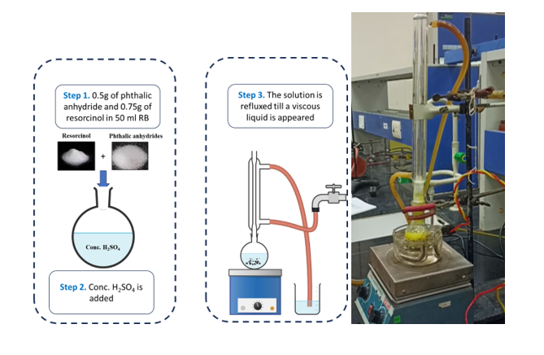
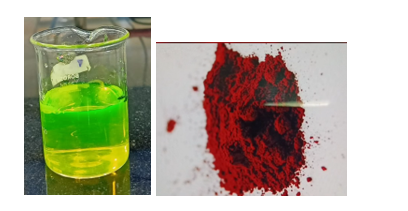
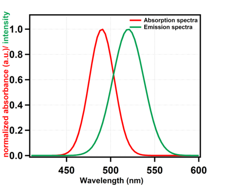

<b>Apparatus</b> 
A.	50 ml round bottom flask and a beaker
B.	A dropper 
C.	A magnetic stirrer with a heater
D.	A magnetic bead
E.	A condenser for reflux
 
 

<b>Chemicals</b> 
A.	0.5g phthalic anhydride
B.	0.75 g of resorcinol.
C.	Conc. H2SO4
D.	Distilled water
E.	Ammonia solution (5ml)
 
 

<b>Procedure </b> 
A.	Weigh out 0.5g of phthalic anhydride and 0.75g of resorcinol and mix them in a round bottom flask. 
B.	Add a few drops of conc. H2SO4 (in fume hood) into the round bottom flask. 
C.	The mixture is refluxed at 1800C till a viscous liquid appears. A magnetic bead is used to stir the solution. 
D.	After formation of viscous liquid, it is allowed to cool for some time.  
E.	10 ml of distilled water is added and a green fluorescent compound appears.  
F.	5 ml of ammonia solution is added into it and stirred.  
G.	The mixture is the poured in distilled water, resulting a yellow green solution. 
H.	After column chromatography we got a dark red pure solid fluorescein.   

<b>Procedure in laboratory (diagram)</b> 
 
  

<b>Results</b> 
After column chromatography of the resulted solution a dark red solid product is obtained. The mass of the resulted product is 0.70g.  

<b>Yield calculation:</b> 
1 mol of phthalic anhydride reacts to give 1 mol of fluorescein.
So, 148.1g of phthalic anhydride reacts to give 332.31g of fluorescein.
0.5g of phthalic anhydride should give 1.122g of fluorescein if the yield is 100%.  

For 0.7g of product the yield is (0.7/1.122)×100 ≈62%. 

The absorption peak is observed at 490 nm and the emission maxima is around 521 nm in ethanolic solution of fluorescein, which matches with the reported values.  

 

