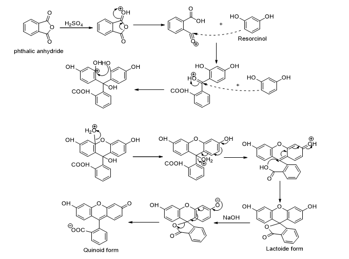

Fluorescein is a brown-red to yellow powder, which is poorly soluble in water. In sodium or potassium hydroxide solution or in ethanol, it readily dissolves giving an intense greenish yellow fluorescence. Two forms of the compound are known, the more stable quinoid dark-red acid free form and a less stable lactoide form, which is yellow in color. On acidification of the fluorescent solution, the fluorescence decreases as only the anion carries the characteristic fluorescence. The dye absorbs light in the blue range of the visible spectrum, with absorption peaking at 490 nm (blue). An additional peak is also observed at 460 nm. It emits light at 530 nm (yellow). The fluorescence and absorbance of fluorescein is quite pH sensitive. 

Fluorescein can be synthesized through the reaction between phthalic anhydride and resorcinol through the following pathway in the presence of acid as a catalyst.  

 
<b>Figure 1.</b>

Fluorescein angiography, also known as "the yellow dye test" is a way of assessing various disease states in the retina and choroid of the human eye. Actually, the sodium salt of fluorescein is used for angiography. A small amount of sodium fluorescein dye is injected into a vein in the patient’s arm (normal adult dosage is 500 mg). A special camera is used to view the retina of the eye. The blue-colored light coming from the camera causes the sodium fluorescein dye to glow in a yellow-green color. As the sequence begins, the image is black because no sodium fluorescein is present in the vessels. A second or so after reaching the choroid, the dye begins to fill the retinal vessels. The arteries become visible first. The dye then travels across the network of fine capillaries, where nutrients and oxygen are transferred to tissue. The dye continues its journey through the retina, filling the veins and exiting the eye. Photographs are usually taken at intervals up to about 10 minutes after the injection of the dye. An ophthalmologist examines the way the fluorescein dye travels through the vessels during the transit phase and the way in which the dye pools or stains tissues in the later phases as a part of the diagnostic process for determining causes of decreased vision. 
